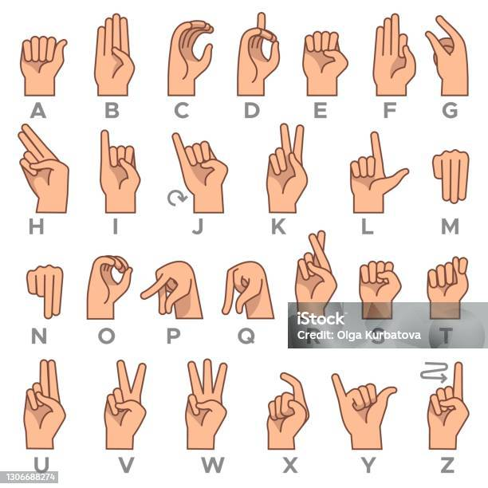

# Alphabet Sign Language Recognition Model

### Problem Statement
Sign language is a vital means of communication for millions of people, yet its understanding and accessibility remain limited in many communities. Alphabetical hand signs, a fundamental component of American Sign Language (ASL), often face challenges in digital interpretation, especially in dynamic and variable environments. This project aims to bridge this gap by creating a robust gesture recognition system leveraging advanced machine learning techniques and the MediaPipe hand landmark model. By enabling accurate detection and interpretation of hand signs, this work seeks to enhance communication inclusivity and contribute to technological solutions that empower the Deaf and Hard of Hearing community.

## Overview

This project focuses on developing a machine learning model to recognize hand gestures representing the alphabet in sign language. The pipeline involves collecting gesture data, extracting meaningful features, training a classifier, and deploying the model for real-time predictions. The following document details the process, components, and code used in the project.

### Broaden the Use Cases
Expand the potential applications of the project, such as:
- **Educational Tools**: Assisting in teaching sign language to children or adults.
- **Communication Assistance**: Facilitating real-time conversations between sign language users and non-users.
- **Integration in Devices**: Potential deployment on devices like AR glasses, smartphones, or kiosks.


---

## Table of Contents

1. [Data Collection](#1-data-collection)  
2. [Data Preprocessing](#2-data-preprocessing)  
3. [Model Training](#3-model-training)  
4. [Model Evaluation](#4-model-evaluation)  
5. [Real-Time Prediction](#5-real-time-prediction)  

---

## 1. Data Collection

### Objective  
To collect hand gesture data for each alphabet sign from A to K, which will be used to train the classification model. 

### Description  
The dataset consists of images captured using a webcam. Each gesture is labeled and stored in a directory corresponding to its class (e.g., A, B, C). This ensures an organized structure for further processing. 

#### Learning from the American Hand Sign language (ASL)




### Third-Party Involvement and Contributions

The Ashesi Sign Language Club provided valuable guidance during this project. They recommended changes to certain hand signs, such as replacing the hand sign for "G" with a more generalized sign that aligns with the ASL standard. 

Additionally, the club shared their expertise on alphabetical hand signs involving movements. This knowledge influenced the project significantly, as I later decided to remove the signs for "H" and "J." These letters were challenging to implement effectively due to resource limitations in identifying moving alphabetical signs accurately.

Their contributions greatly enhanced the depth and practicality of this work.


#### Examples of collecting data


#### Data Collection Process

#### Dataset Diversity
To ensure the model's robustness and ability to generalize across real-world scenarios, special attention was given to the diversity of the dataset. Gestures were collected from individuals with varying skin tones, hand sizes, and background environments. This approach aimed to reduce biases and enhance the accuracy of the model when applied to a broad spectrum of users. Efforts were also made to include images with different lighting conditions, including natural, dim, and artificial lighting, to simulate real-world scenarios effectively.

I maintained hand sign movements like moving sideways front and back in area bounds which were detectable by the mediapiple hand detector model. This helped me to create different variation of the hand sign for the same same improving the accuracy in different environment.

### Challenges in Data Collection
Building a comprehensive dataset presented several challenges, including:

1. Inconsistent Lighting: Variations in light intensity and direction often created shadows and glare, affecting the visibility of hand landmarks. This was mitigated by carefully selecting well-lit environments and applying basic image preprocessing techniques.

2. Incorrect Hand Positions: Participants occasionally placed their hands outside the detectable bounds of the MediaPipe model. Repeated trials were conducted to ensure gestures were performed within the detection area.

3. Background Noise: Busy or cluttered backgrounds occasionally interfered with the landmark detection process. A neutral or plain background was preferred during data collection, and erroneous samples were excluded during preprocessing.

4. Computational Power: I was unable to meet the requirements to effectively and fully train the images in understanding the signs.

---

## Highlight Model Selection
Reasoning behind choosing a **Random Forest Classifier**:
- **Advantages**: Random Forest handles structured data effectively, resists overfitting, and offers interpretability.
- **Comparison with Other Algorithms**:
  - **SVM**: Could have been used for smaller datasets but lacks scalability.
  - **Neural Networks**: Suitable for image-based data but computationally intensive.
- **Mathematical Basis**: The key formula for decision tree splitting, was as the Gini Impurity:
  \[
  Gini = 1 - \sum_{i=1}^{n} p_i^2
  \]

---

## Results Section
Summarize model performance:
- **Metrics**: Include overall accuracy, precision, recall, and F1-score.


### Performance Metrics
| Metric        | Value  |
|---------------|--------|
| Accuracy      |  100%  |
| Precision     |  100%  |
| Recall        |  100%  |
| F1-Score      |  100%  |

### Hardware
I used my Pc's web camera to record the data. My Dell E7450 has a HD camera resolution	1280 x 720 pixels, therefore a better resolution would definately lead to higher accuracy but the trade of here is the time for training your model.

### Implementation  
The `collect_create_data.py` script is used to collect images for different classes:
- The script initializes the webcam feed.
- Users are prompted to gesture specific signs, and frames are captured automatically. 
- MediaPipe ensures that hand landmarks are detected before saving the images.

#### Key Features in `collect_create_data.py`:
- Real-time hand detection using MediaPipe.
- Validation of hand presence before saving the frame.
- Organized storage of images by class.

---

## 2. Data Preprocessing

### Objective  
To preprocess the collected images and extract meaningful hand landmarks for use in the classification model. 

### Description  
This step uses **MediaPipe** to identify hand landmarks (e.g., finger joints, palm positions) in each image. These landmarks are then normalized to ensure consistency across images and stored as key points.

### Implementation  
The preprocessing is performed using the `collect_create_data.py` script. The following tasks are completed:
1. Hand detection: Ensures the presence of a hand in the image.
2. Landmark extraction: Uses MediaPipe to extract 21 hand key points.
3. Normalization: Key points are normalized to account for differences in image size and positioning.
4. Data saving: Extracted features and labels are saved in a `.pickle` file for model training.

---

## 3. Model Training

### Objective  
To train a machine learning model capable of classifying hand gestures into alphabet signs based on extracted features.

### Description  
The model leverages a **Random Forest Classifier**, which is robust and performs well for structured feature-based datasets. The training process includes splitting the data into training and testing sets and evaluating the classifier's performance.

### Implementation  
The model training is performed in the `AlphabetSignLanguage.ipynb` notebook. Key steps include:
1. Loading the preprocessed data from the `.pickle` file.
2. Splitting the dataset into training and testing sets.
3. Training a Random Forest Classifier.
4. Saving the trained model for deployment.

#### Example Code from `AlphabetSignLanguage.ipynb`:
```python
from sklearn.ensemble import RandomForestClassifier
from sklearn.model_selection import train_test_split
from sklearn.metrics import accuracy_score

# Load data
data_dict = pickle.load(open('./keypoints_data.pickle', 'rb'))
data = np.asarray(data_dict['data'])
labels = np.asarray(data_dict['labels'])

# Train-test split
x_train, x_test, y_train, y_test = train_test_split(data, labels, test_size=0.2, shuffle=True, stratify=labels)

# Train Random Forest
model = RandomForestClassifier()
model.fit(x_train, y_train)

# Save the model
with open('model.pickle', 'wb') as f:
    pickle.dump({'model': model}, f)
```


## 4. Model Evaluation

### Objective  
To assess the performance of the trained model using unseen test data.

### Description  
The model's accuracy and classification report are evaluated using the test set. Metrics like precision, recall, and F1-score provide insights into the model's performance for each class.

### Key Metrics:
- **Accuracy**: Overall percentage of correct predictions.
- **Precision**: How often the model's positive predictions are correct.
- **Recall**: How well the model identifies actual positives.

Model evaluation is included in the `AlphabetSignLanguage.ipynb` notebook.

---

## 5. Real-Time Prediction

### Objective  
To deploy the trained model for real-time gesture recognition using a webcam.

### Description  
The system performs the following tasks:
1. **Captures live video feed**: Using a webcam to record frames in real time.
2. **Processes frames using MediaPipe**: Extracts hand landmarks for prediction.
3. **Uses the trained classifier**: Predicts the alphabet sign for each frame based on extracted landmarks.
4. **Displays the prediction in real-time**: Overlays the predicted letter on the frame along with visualizations of hand landmarks.

### Implementation  
The `imageclassifier.py` script handles real-time predictions with the following steps:
1. **MediaPipe Integration**: Extracts hand landmarks in real-time from webcam frames.
2. **Model Loading**: Loads the trained Random Forest model to classify hand gestures.
3. **Prediction Display**: Draws bounding boxes around detected hands and overlays the predicted alphabet sign on the frame for user feedback.


## Deployment On HuggingFace
The trained model for the sign language gesture recognition project has been deployed on HuggingFace. You can access and download the model using the following link:

[Sign Language Model on HuggingFace](https://huggingface.co/KEJEvans/sign-language-model)


```python
from huggingface_hub import hf_hub_download

model_path = hf_hub_download(repo_id="KEJEvans/sign-language-model", filename="model.pkl")
```

## Video Tutorial

For a detailed step-by-step guide on how to use this project, check out the video tutorial:

[](https://youtu.be/I9KcK2Jwm2Y)

